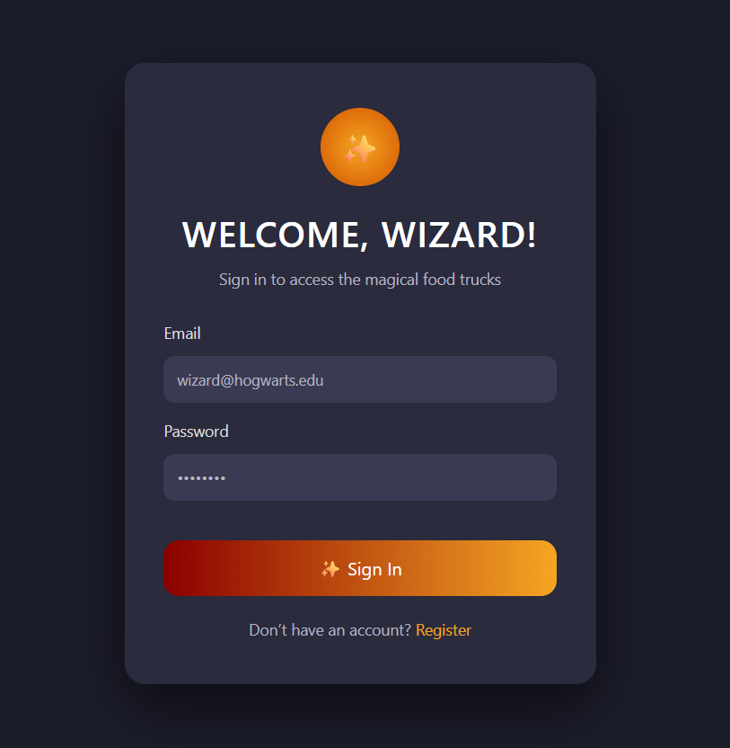
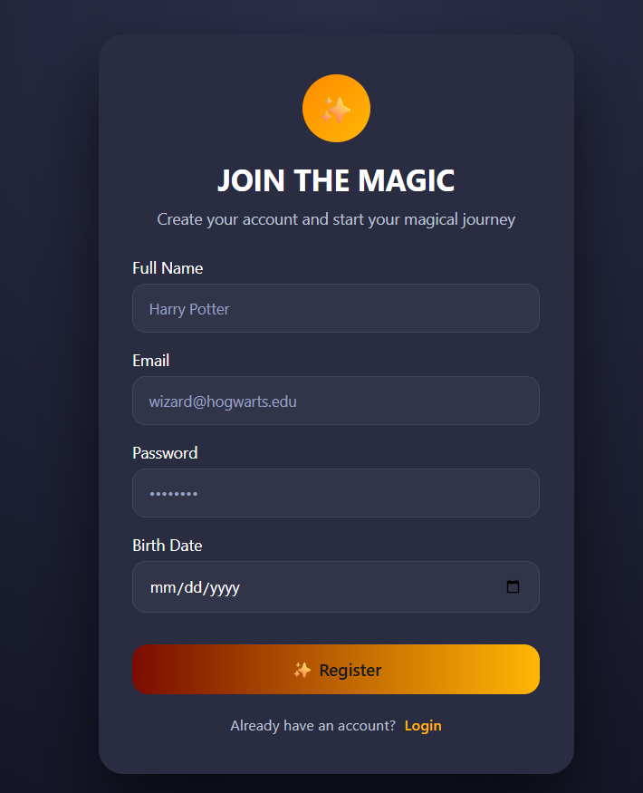
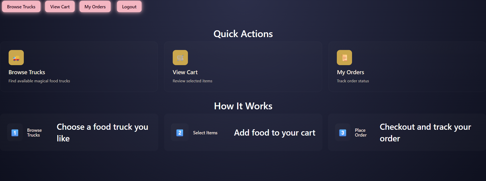
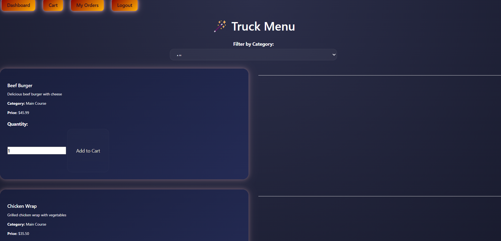
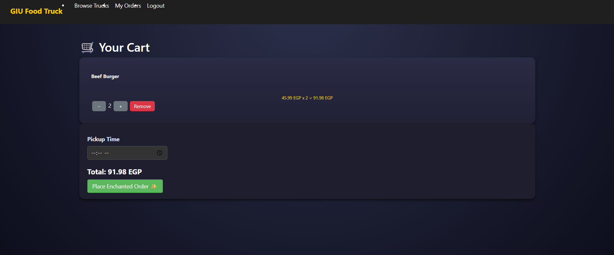
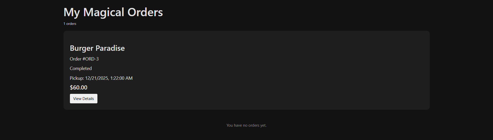
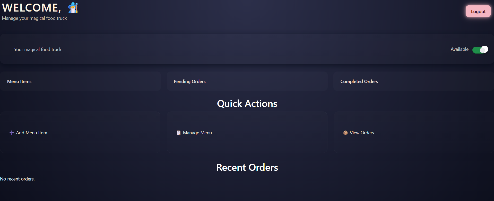
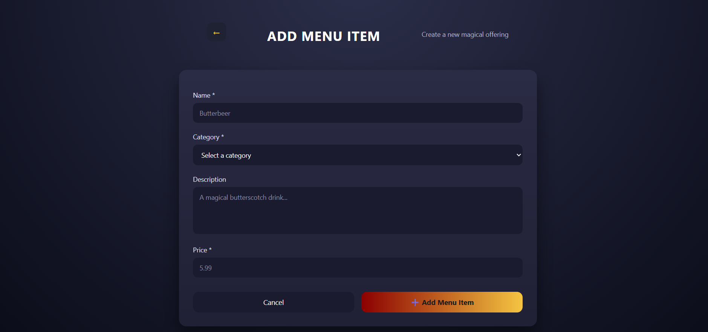
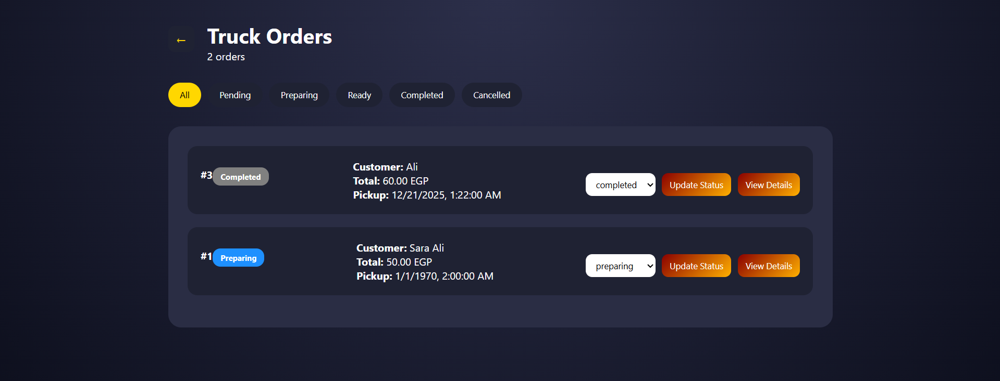
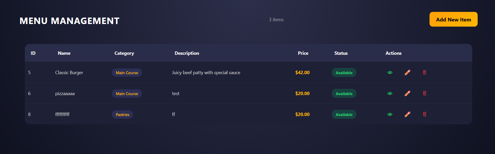

# GIU Food Truck Management System

A full-stack web application for managing food truck operations, built with Node.js, Express, PostgreSQL, and vanilla JavaScript/jQuery.

## 1. Project Title and Description

### Project Name
**GIU Food Truck Management System**

### Description
A comprehensive web-based platform that enables customers to browse, order, and track food from various food trucks, while allowing truck owners to manage their inventory, menus, and customer orders in real-time.

### Team Members
| Name | ID | Tutorial |
|------|----|-----------| 
| [Ali Hassan Ibrahim] | [16008201] | [T15] |
| [Ahmed Mohamed Mohamed] | [16009678] | [T15] |
| [Rahaf Mohammad Kandil] | [16009110] | [T19] |
| [Rawda Mohammad] | [16006487] | [T11] |
| [Nadine Nader] | [16001712] | [T11] |
| [Mennat Allah Hossam] | [16020508] | [T17] |
| [Mariam khedr] | [16008810] | [T11] |
  


---

## Table of Contents
- [Project Title and Description](#1-project-title-and-description)
- [Features](#2-features)
- [Technology Stack](#3-technology-stack)
- [ERD - Database Schema](#4-erd---database-schema)
- [Installation & Setup](#5-installation--setup)
- [Test Credentials](#6-test-credentials)
- [Screenshots](#7-screenshots)
- [API Endpoints Summary](#8-api-endpoints-summary)
- [Contributors](#9-contributors)

---

## 2. Features

### Customer Features
- ✅ **User Registration** - Create new customer account with email, password, and birth date
- ✅ **User Authentication** - Secure login with session-based token authentication
- ✅ **Browse Trucks** - View all available food trucks in the system
- ✅ **View Menu** - Browse menu items from selected trucks with descriptions and prices
- ✅ **Shopping Cart** - Add items to cart with quantity adjustment
- ✅ **Cart Management** - Remove items from cart, view total price
- ✅ **Single Truck Constraint** - Can only order from one truck per order
- ✅ **Place Orders** - Checkout and create orders from cart items
- ✅ **Order History** - View all past orders with details
- ✅ **Order Tracking** - Check order status and pickup times

### Truck Owner Features
- ✅ **Owner Registration** - Create owner account
- ✅ **Truck Management** - Create and manage food trucks
- ✅ **Menu Management** - Add menu items with name, description, price, category
- ✅ **Availability Control** - Toggle truck order availability status
- ✅ **Truck Status Management** - Update truck status (available/unavailable)
- ✅ **View Orders** - See all incoming orders for their truck
- ✅ **Order Status Update** - Update order status as items are prepared
- ✅ **Dashboard** - Owner dashboard to manage trucks and orders
- ✅ **Item Availability** - Set menu items as available/unavailable

### System Features
- ✅ **Session Management** - User sessions with 3-hour expiration
- ✅ **Authorization** - Role-based access (customer vs owner)
- ✅ **Input Validation** - Form validation on client and server
- ✅ **Error Handling** - Comprehensive error messages and handling
- ✅ **Database Persistence** - All data stored in PostgreSQL
- ✅ **Responsive UI** - Bootstrap-based responsive design

---

## 3. Technology Stack

### Frontend
- **HTML5** - Semantic markup
- **CSS3** - Styling with Bootstrap 3.x and custom CSS
- **JavaScript (ES6+)** - Client-side interactivity
- **jQuery 2.2.0** - DOM manipulation and AJAX
- **Bootstrap 3.x** - Responsive grid and components
- **Handlebars/HJS** - Server-side templating

### Backend
- **Node.js** - JavaScript runtime
- **Express.js 4.x** - Web framework and routing
- **Knex.js 2.x** - SQL query builder and database abstraction
- **UUID v4** - Session token generation
- **Axios** - HTTP client for server communication
- **Dotenv** - Environment variable management
- **Nodemon** - Development auto-reload

### Database
- **PostgreSQL 8.x+** - Relational database
- **pgAdmin 4** - Database management tool

### Deployment & Tools
- **npm** - Package manager
- **Git** - Version control
- **Thunder Client / Postman** - API testing

---

## 4. ERD - Database Schema

### Entity Relationship Diagram

```
┌─────────────────┐         ┌──────────────────┐
│     Users       │         │    Sessions      │
├─────────────────┤         ├──────────────────┤
│ userId (PK)     │◄────────│ sessionId (PK)   │
│ name            │    1:N  │ userId (FK)      │
│ email (UNIQUE)  │         │ token (UUID)     │
│ password        │         │ expiresAt        │
│ role            │         └──────────────────┘
│ birthDate       │
│ createdAt       │
└────────┬────────┘
         │
         │ 1:N
         ▼
┌─────────────────────┐     ┌──────────────────┐
│     Trucks          │     │    MenuItems     │
├─────────────────────┤     ├──────────────────┤
│ truckId (PK)        │◄────│ itemId (PK)      │
│ truckName (UNIQUE)  │ 1:N │ truckId (FK)     │
│ truckLogo           │     │ name             │
│ ownerId (FK)────────┼─┐   │ description      │
│ truckStatus         │ └───│ price            │
│ orderStatus         │     │ category         │
│ createdAt           │     │ status           │
└─────────┬───────────┘     │ createdAt        │
          │                 └────────┬─────────┘
          │                          │
          │ 1:N                      │ 1:N
          ▼                          ▼
     ┌──────────────┐        ┌──────────────────┐
     │   Orders     │        │    Carts         │
     ├──────────────┤        ├──────────────────┤
     │ orderId (PK) │        │ cartId (PK)      │
     │ userId (FK)  │        │ userId (FK)      │
     │ truckId (FK) │        │ itemId (FK)      │
     │ orderStatus  │        │ quantity         │
     │ totalPrice   │        │ price            │
     │ scheduled... │        └──────────────────┘
     │ createdAt    │
     └────────┬─────┘
              │
              │ 1:N
              ▼
       ┌─────────────────────┐
       │   OrderItems        │
       ├─────────────────────┤
       │ orderItemId (PK)    │
       │ orderId (FK)        │
       │ itemId (FK)         │
       │ quantity            │
       │ price               │
       └─────────────────────┘
```

### Suggested Tables

#### 1. **Users** Table
```sql
userId (Serial PK) | name (Text) | email (Text UNIQUE) | password (Text) 
| role (Text: 'customer'/'owner') | birthDate (Date) | createdAt (Timestamp)
```
**Purpose**: Store all user accounts (customers and truck owners)

#### 2. **Trucks** Table
```sql
truckId (Serial PK) | truckName (Text UNIQUE) | truckLogo (Text) 
| ownerId (Int FK→Users) | truckStatus (Text) | orderStatus (Text) | createdAt (Timestamp)
```
**Purpose**: Store food truck information and ownership

#### 3. **MenuItems** Table
```sql
itemId (Serial PK) | truckId (Int FK→Trucks) | name (Text) | description (Text) 
| price (Numeric) | category (Text) | status (Text) | createdAt (Timestamp)
```
**Purpose**: Store menu items for each truck

#### 4. **Orders** Table
```sql
orderId (Serial PK) | userId (Int FK→Users) | truckId (Int FK→Trucks) 
| orderStatus (Text) | totalPrice (Numeric) | scheduledPickupTime (Timestamp) 
| estimatedEarliestPickup (Timestamp) | createdAt (Timestamp)
```
**Purpose**: Store customer orders

#### 5. **OrderItems** Table
```sql
orderItemId (Serial PK) | orderId (Int FK→Orders) | itemId (Int FK→MenuItems) 
| quantity (Int) | price (Numeric)
```
**Purpose**: Store individual items in each order

#### 6. **Carts** Table
```sql
cartId (Serial PK) | userId (Int FK→Users) | itemId (Int FK→MenuItems) 
| quantity (Int) | price (Numeric)
```
**Purpose**: Store temporary shopping carts before checkout

#### 7. **Sessions** Table
```sql
sessionId (Serial PK) | userId (Int FK→Users) | token (UUID) | expiresAt (Timestamp)
```
**Purpose**: Store active user sessions for authentication

### Key Relationships
- **Users → Trucks**: 1:N (One owner can have multiple trucks)
- **Trucks → MenuItems**: 1:N (One truck can have multiple menu items)
- **Users → Orders**: 1:N (One customer can place multiple orders)
- **Users → Carts**: 1:N (One customer can have multiple cart items)
- **Trucks → Orders**: 1:N (One truck can receive multiple orders)
- **Orders → OrderItems**: 1:N (One order can have multiple items)
- **MenuItems → OrderItems**: 1:N (One menu item can be in multiple orders)
- **Users → Sessions**: 1:N (One user can have multiple sessions)

---

## 5. Installation & Setup

### Prerequisites
Before you begin, ensure you have installed:
1. **Node.js** (v14 or higher) - [Download](https://nodejs.org/)
2. **PostgreSQL** (v12 or higher) - [Download](https://www.postgresql.org/download/)
3. **pgAdmin 4** (comes with PostgreSQL) - Database management tool
4. **Visual Studio Code** - [Download](https://code.visualstudio.com/)
5. **Thunder Client Extension** (for testing APIs) - Install from VS Code Extensions

### Step-by-Step Setup Guide

#### Step 1: Setup PostgreSQL Database
1. Open **pgAdmin 4**
2. Right-click on **Servers** → **Create** → **Server**
3. Fill in the following:
   - **Name**: `db_server`
   - **Host name/address**: `localhost`
   - **Port**: `5432`
   - **Username**: `postgres`
   - **Password**: *(Use the password you set during PostgreSQL installation)*
4. Click **Save**

#### Step 2: Create Database Schema
1. In pgAdmin 4, navigate to: `db_server` → **Databases** → `postgres` → **Schemas**
2. Right-click on **Schemas** → **Create** → **Schema**
3. Name it: `FoodTruck` (or `backendProject`)
4. Click **Save**

#### Step 3: Create Database Tables
1. Right-click on the new schema → **Query Tool**
2. Open `connectors/scripts.sql` from the project
3. Copy all SQL commands
4. Paste into the Query Tool
5. Click **Execute** (or press F6)
6. All tables will be created automatically

#### Step 4: Clone and Setup Project
```bash
# Navigate to your desired directory
cd c:\Users\user\Desktop

# Clone or navigate to the project
cd effective-sniffle-new

# Install dependencies
npm install axios express knex pg uuid hjs dotenv
npm install nodemon --save-dev
```

#### Step 5: Configure Environment Variables
1. Create a `.env` file in the project root directory
2. Add the following:
```env
PASSWORD=your_postgres_password
PORT=3001
NODE_ENV=development
```
Replace `your_postgres_password` with the password you set during PostgreSQL installation

#### Step 6: Seed Sample Data (Optional)
1. Open pgAdmin 4 → Query Tool on `FoodTruck` schema
2. Open `connectors/seed.sql` from the project
3. Execute to populate with sample data

#### Step 7: Start the Server
```bash
# Development mode with auto-reload
npm run server

# Or manually
node server.js
```

Expected output:
```
Server is now listening at port 3001 on http://localhost:3001/
```

#### Step 8: Access the Application
Open your browser and navigate to:
```
http://localhost:3001/
```

### Verification Checklist
- [ ] Node.js installed and accessible (`node --version`)
- [ ] PostgreSQL running on localhost:5432
- [ ] Database schema `FoodTruck` created
- [ ] All tables created from scripts.sql
- [ ] `.env` file configured with correct password
- [ ] Dependencies installed (`npm install` completed)
- [ ] Server running without errors
- [ ] Can access http://localhost:3001/ in browser

---

## 6. Test Credentials

### Sample Test Accounts

#### Customer Account
- **Email**: `customer@example.com`
- **Password**: `password123`
- **Name**: John Doe
- **Birth Date**: 1995-05-15
- **Role**: customer

#### Customer Account 2
- **Email**: `sarah@example.com`
- **Password**: `pass1234`
- **Name**: Sarah Smith
- **Birth Date**: 1998-08-22
- **Role**: customer

#### Truck Owner Account
- **Email**: `owner@foodtruck.com`
- **Password**: `owner123`
- **Name**: Ali Ahmed
- **Birth Date**: 1990-03-10
- **Role**: owner
- **Truck Name**: Ali's Tacos
- **Truck Status**: available
- **Order Status**: available

#### Truck Owner Account 2
- **Email**: `rawda@foodtruck.com`
- **Password**: `rawda456`
- **Name**: Rawda Mohamed
- **Birth Date**: 1992-07-18
- **Role**: owner
- **Truck Name**: Rawda's Pizza
- **Truck Status**: available
- **Order Status**: available

### How to Test
1. **Register a New Account**: Go to `/register` and create a test account
2. **Login**: Use the test credentials above at `/`
3. **Test as Customer**: Browse trucks, add to cart, place orders
4. **Test as Owner**: View orders, manage menu items
5. **Test API**: Use Thunder Client to test endpoints

### Sample Menu Items (For Testing Owners)
| Item Name | Price | Category | Description |
|-----------|-------|----------|-------------|
| Beef Tacos | $8.99 | Tacos | Delicious beef tacos with lettuce and cheese |
| Fish Tacos | $9.99 | Tacos | Fresh fish tacos with cabbage slaw |
| Cheese Pizza | $12.99 | Pizza | Classic cheese pizza with mozzarella |
| Pepperoni Pizza | $14.99 | Pizza | Pizza topped with pepperoni and cheese |

---

## 7. Screenshots

### Customer Interface

#### 1. Login Page
- Email and password input fields
- Registration link
- Form validation
- Error messages display

*Screenshot location: `/screenshots/01-login.png`*


#### 2. Registration Page
- Full name, email, password input fields
- Birth date picker
- Form validation
- Error handling

*Screenshot location: `/screenshots/02-register.png`*


#### 3. Customer Homepage 
- Browse all available food trucks
- View truck names and logos
- Click to view truck menu
- Navigate to cart

*Screenshot location: `/screenshots/03-customer-homepage.png`*

#### 4.browse trucks
-view trucks 
-click to view truck menu
*Screenshot location: `/screenshots/03-browse-trucks.png`*


#### 5. Truck Menu Page
- Display all menu items for selected truck
- Item name, price, description, category
- Add to cart button with quantity selector
- View cart summary

*Screenshot location: `/screenshots/04-truck-menu.png`*

#### 6. Shopping Cart Page
- List of items in cart
- Quantity adjustment controls
- Item prices and total price
- Remove item buttons
- Checkout button

*Screenshot location: `/screenshots/05-cart.png`*

#### 7. Orders History Page
- View all past orders
- Order ID, date, truck name, total price
- Order status
- Order details/items

*Screenshot location: `/screenshots/06-my-orders.png`*

### Truck Owner Interface

#### 8. Owner Dashboard
- Welcome message
- Truck status information
- Quick action buttons
- Navigate to menu items, orders, settings

*Screenshot location: `/screenshots/07-owner-dashboard.png`*

#### 9. Add Menu Item Page
- Form to add new menu items
- Fields: name, description, price, category
- Submit button
- Success/error messages

*Screenshot location: `/screenshots/08-add-menu-item.png`*

#### 10. Truck Orders Page
- View all incoming customer orders
- Order ID, customer name, items, status
- Update order status buttons
- Order timeline/history

*Screenshot location: `/screenshots/09-truck-orders.png`*

#### 11. Menu Items Management Page
- List all menu items for the truck
- Item name, price, category, status
- Edit/delete buttons
- Add new item button
- Toggle availability status

*Screenshot location: `/screenshots/10-menu-items.png`*

---

## 8. API Endpoints Summary

### Base URL
```
http://localhost:3001/api/v1
```

### Authentication
- Uses **session-based authentication** with UUID tokens
- Token stored in `session_token` cookie
- Session expires after 3 hours
- Protected routes require valid session

### Public Endpoints (No Authentication Required)

| HTTP Method | Endpoint | Description | Request Body | Response |
|------------|----------|-------------|--------------|----------|
| GET | `/` | Load login page | - | HTML |
| GET | `/register` | Load registration page | - | HTML |
| POST | `/api/v1/user` | Register new user | `{name, email, password, birthDate}` | 200 OK / 400 Error |
| POST | `/api/v1/user/login` | User login | `{email, password}` | 200 OK / 400 Error |
| GET | `/api/v1/trucks/view` | Get all available trucks | - | `[{truckId, truckName, ...}]` |
| GET | `/api/v1/menuItem/truck/:truckId` | Get menu items by truck | - | `[{itemId, name, price, ...}]` |

### Private Endpoints (Authentication Required)

| HTTP Method | Endpoint | Description | Request Body | Response |
|------------|----------|-------------|--------------|----------|
| POST | `/api/v1/cart/new` | Add item to cart | `{itemId, quantity, price}` | `{message: "..."}` |
| GET | `/api/v1/cart` | Get user's cart items | - | `[{cartId, itemId, quantity, ...}]` |
| DELETE | `/api/v1/cart/:cartId` | Remove item from cart | - | `{message: "..."}` |
| POST | `/api/v1/orders` | Create order from cart | `{truckId}` | `{orderId, totalPrice, ...}` |
| GET | `/api/v1/myOrders` | Get user's orders | - | `[{orderId, totalPrice, status, ...}]` |
| GET | `/api/v1/orders/:orderId` | Get order details | - | `{orderId, items, totalPrice, ...}` |
| GET | `/api/v1/truckOrders` | Get orders for owner's truck | - | `[{orderId, userId, totalPrice, ...}]` |
| PUT | `/api/v1/trucks/updateOrderStatus` | Update truck order availability | `{orderStatus}` | `{message: "..."}` |
| POST | `/api/v1/addMenuItem` | Add menu item (owner only) | `{name, description, price, category}` | `{itemId, message: "..."}` |
| PUT | `/api/v1/menuItem/:itemId` | Update menu item | `{name, description, price, status}` | `{message: "..."}` |
| DELETE | `/api/v1/menuItem/:itemId` | Delete menu item | - | `{message: "..."}` |
| PUT | `/api/v1/orders/:orderId/status` | Update order status | `{orderStatus}` | `{message: "..."}` |

### Response Format

#### Success Response (200)
```json
{
  "success": true,
  "message": "Operation successful",
  "data": {}
}
```

#### Error Response (400, 404, 500)
```json
{
  "success": false,
  "message": "Error description",
  "error": "error_code"
}
```

### Common Status Codes
| Code | Meaning |
|------|---------|
| 200 | OK - Request successful |
| 400 | Bad Request - Invalid input |
| 401 | Unauthorized - Not authenticated |
| 404 | Not Found - Resource not found |
| 500 | Internal Server Error - Server error |

---

## 9. Contributors

### Team Member Contributions

| Team Member Name | ID | Role | Contributions |
|------------------|----|----|---|
| [Name 1] | [ID] | Backend Lead | User authentication, Order management APIs, Database design |
| [Name 2] | [ID] | Frontend Lead | Customer UI, Shopping cart, Menu display |
| [Name 3] | [ID] | Database Admin | Schema design, Data integrity, Query optimization |
| [Name 4] | [ID] | QA & Integration | Testing, Bug fixes, Documentation |

### Specific Contributions

#### Backend Development
- REST API endpoints (user, cart, orders, trucks)
- PostgreSQL database design and optimization
- Session-based authentication system
- Database query optimization with Knex.js
- Error handling and validation

#### Frontend Development
- HTML template design with HJS
- CSS styling with Bootstrap
- Client-side form validation
- JavaScript/jQuery functionality
- Responsive UI design

#### Database & Architecture
- Entity Relationship Diagram design
- Table structure and relationships
- Data integrity constraints
- Sample data seeding
- Database backup/recovery procedures

#### Documentation & Testing
- README.md comprehensive documentation
- API endpoint documentation
- Step-by-step installation guide
- Test credentials and sample data
- Bug testing and QA
- Code review and quality assurance

### Git Commit History
Key milestones in development:
- Initial project setup and database schema
- User authentication implementation
- Customer features (browse, cart, orders)
- Truck owner features (menu management, order tracking)
- Bug fixes and optimization
- Final documentation and deployment

---

## Additional Notes

### Project Structure
```
effective-sniffle-new/
├── README.md
├── package.json
├── server.js
├── .env
├── connectors/
│   ├── db.js
│   ├── scripts.sql
│   └── seed.sql
├── middleware/
│   └── auth.js
├── routes/
│   ├── public/
│   │   ├── api.js
│   │   └── view.js
│   └── private/
│       ├── api.js
│       └── view.js
├── utils/
│   └── session.js
├── public/
│   ├── src/
│   ├── styles/
│   └── js/
└── views/
    └── *.hjs
```

### Development Commands
```bash
# Install dependencies
npm install

# Start development server
npm run server

# Stop server (Ctrl + C)

# Test with Thunder Client or Postman
# Import and test API endpoints
```

### Known Issues & Solutions
- Session expires after 3 hours - manually update `.env` or database
- Can only order from one truck - by design for simplicity
- Password stored as plaintext - use bcrypt in production
- No payment integration - add Stripe/PayPal for production

### Future Enhancements
- Password hashing with bcrypt
- Payment gateway integration
- Real-time notifications
- GPS tracking for trucks
- Rating and review system
- Admin dashboard
- Email confirmations
- Push notifications
- Mobile app version

---

**Last Updated**: December 2025
**Version**: 1.0.0
**Status**: Complete
